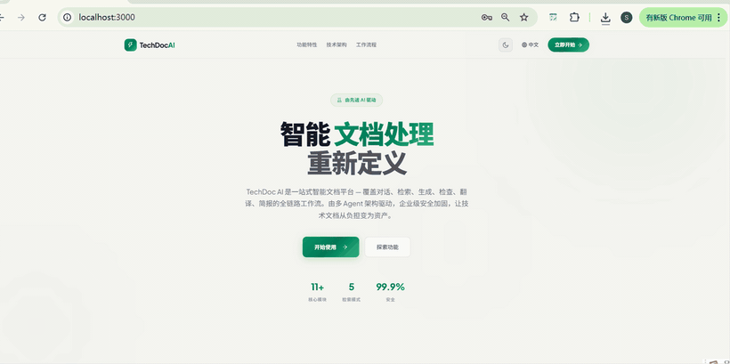

# SmartPages

<p align="right"><a href="README.md">中文</a></p>

<p align="center">
  
</p>

<h3 align="center">Record once. Turn the workflow into clear documentation.</h3>

<p align="center">
  An open-source browser workflow recorder and AI documentation assistant.<br>
  Capture actions and screenshots, then generate documentation you can edit, refine, and export.
</p>

<p align="center">
  
  
  
  
</p>

<p align="center">
  
</p>

## Why SmartPages

The slow part of writing a user guide, test case, or bug report is rarely the workflow itself. It is reconstructing every step, screenshot, and explanation afterward. SmartPages turns that repeated work into a single recording.

| Automatic capture | AI-generated docs | Flexible delivery |
| --- | --- | --- |
| Record clicks, input, navigation, and step screenshots | Create guides, tutorials, test cases, and bug reports | Edit and refine, then export to Markdown, HTML, text, or PDF |

- **Bring your preferred model:** use GPT, Gemini, Claude, DeepSeek, or a custom OpenAI-compatible API.
- **Control the writing style:** configure prompts, style guides, and example documents for consistent output.
- **Open-source and locally configured:** the extension is open source, and API keys stay in Chrome Storage.

## How It Works

1. Open the target page and start recording from the extension.
2. Complete the workflow normally while SmartPages captures steps and screenshots.
3. Stop recording and choose a document type or custom goal in the side panel.
4. Generate the document with your configured model.
5. Edit or refine the result, then copy or export it.

## Installation

### Load the source directory

1. Download or clone this repository.
2. Open `chrome://extensions/` or `edge://extensions/`.
3. Enable Developer mode.
4. Choose **Load unpacked** and select the project root.

### Build and load `dist/`

```bash
git clone https://github.com/Teddy9710/smartpages.git
cd smartpages
npm install
npm run build
```

Return to the extensions page and load the project's `dist/` directory. After code changes, run `npm run build` again and refresh the extension.

## Quick Start

1. Open Settings, select a model provider, and enter the API key, base URL, and model name.
2. Select **Test Connection**.
3. Open the page you want to document, start recording, and complete the workflow.
4. Stop recording, choose a document goal in the side panel, and generate.
5. Edit the preview directly or ask AI to refine it.
6. Copy the content or export it as Markdown, HTML, plain text, Word, ZIP, an image, or PDF.

> The PDF action opens the browser print dialog. Choose **Save as PDF** to create a fixed-layout file.

## Core Capabilities

### Capture real browser workflows

- Record clicks, input, and SPA route changes.
- Keep a screenshot for each important step.
- Re-inject the recorder when needed to reduce manual page refreshes.

### Generate documentation for the job

- Start from built-in goals for user guides, tutorials, test cases, and bug reports.
- Append extra requirements or replace the prompt entirely.
- Apply type-specific style guides and Markdown or HTML examples.
- Configure the output format and maximum token count for different deliverables.

### Finish the document in the side panel

- Edit the rendered preview directly or switch to Markdown source.
- Refine with AI and revert to the previous version.
- Copy, download, and export in multiple formats.
- Manage TXT, Markdown, HTML, and RTF document resources.

## Product Tour

<p align="center">
  
</p>

| Surface | Purpose |
| --- | --- |
| Popup | Start or stop recording, check status, and open the document assistant |
| Side Panel | Generate, edit, refine, and export documents |
| Settings | Configure models, prompts, style guides, examples, and output formats |

## Model Compatibility

SmartPages supports two API families:

- **OpenAI-compatible Chat Completions:** GPT / OpenAI, Gemini / Google, GLM, DeepSeek, MiniMax, Kimi, OpenRouter, SiliconFlow, DashScope, and custom compatible services.
- **Anthropic Messages API:** Claude / Anthropic.

Model names, base URLs, context limits, and pricing vary by provider. Refer to the provider's official documentation.

## Privacy and Security

- API keys are stored in Chrome Storage and are not committed to the repository.
- Recorded data is sent only to the model API you configure when you generate a document.
- Extension pages use Manifest V3 CSP, and third-party scripts are bundled locally.
- Dynamic HTML is sanitized before rendering and export to reduce XSS risk.
- Generation prompts instruct the model to mask passwords, tokens, phone numbers, and identity numbers. You should still avoid recording sensitive information whenever possible.

## Development and Contributing

```bash
npm run dev         # Build dist/ in watch mode
npm test            # Run the test suite
npm run lint        # Run ESLint
npm run typecheck   # Run TypeScript checks
npm run build       # Generate the loadable dist/ directory
npm run verify      # Run the full verification pipeline
```

More project documentation:

- [Quick start](QUICKSTART.md)
- [Testing guide](TESTING.md)
- [Troubleshooting](TROUBLESHOOTING.md)
- [Code structure](CODE_STRUCTURE.md)
- [Example documents](docs/examples/README.md)

Issues and pull requests are welcome. Please read the [Contributor License Agreement](CONTRIBUTING.en.md) before contributing.

## License

SmartPages uses a dual-license model:

| Use case | License | Details |
| --- | --- | --- |
| Personal, educational, and non-commercial use | [GPL v3](LICENSE) | Free to use, modify, and distribute; derivative works must remain open source |
| Commercial use | Commercial license | A separate license is required before integration into commercial products, SaaS services, or enterprise deployments |

The copyright holder retains all commercial rights. For commercial licensing, contact the author through [GitHub Issues](https://github.com/Teddy9710/smartpages/issues).
