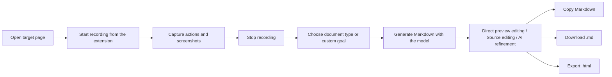
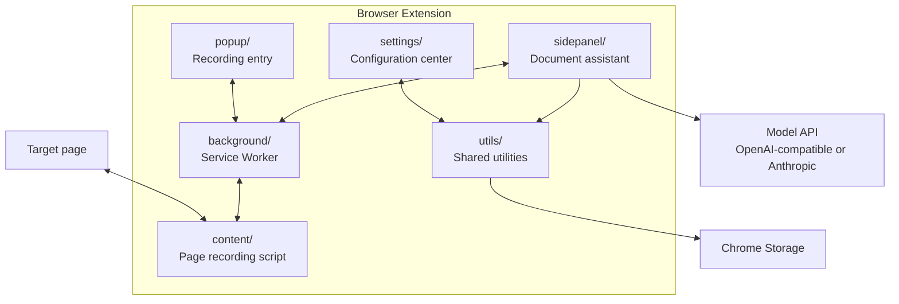

# SmartPages

[中文](README.md)

<p align="center">
  
</p>

<p align="center">
  <strong>Browser workflow recording + AI document generation</strong><br>
  <small>An open-source alternative to Scribe & Tango. Record once, AI writes the doc.</small><br>
  Record web operations and turn them into editable, optimizable, exportable documentation.
</p>

<p align="center">
  
  
  
  
</p>

---

## Overview

SmartPages is a browser extension that converts real web workflows into structured documentation. It is useful for QA, implementation teams, product managers, support teams, operations teams, and anyone who frequently writes step-by-step instructions.

The extension records key actions such as clicks, text input, and page navigation, while keeping screenshots for each step. After recording, it calls the configured GPT, Gemini, Claude, or compatible model provider to generate a document. Users can directly edit the rendered preview in the side panel, switch to Markdown source editing, run AI refinement, revert changes, copy, download Markdown, or export a standalone HTML file.

---

## Interface

<p align="center">
  
</p>

| Page | Purpose |
| --- | --- |
| Popup | Start recording, stop recording, check recording status, open the document assistant |
| Side Panel Document Assistant | Select document type, generate content, edit the preview directly, edit Markdown, refine with AI, revert, export |
| Settings | Configure provider, API key, base URL, model name, tokens, prompts, style guide, and example documents |
| Content Script | Injected into target pages to capture user actions and screenshots |
| Background Service Worker | Manages recording sessions, message forwarding, screenshots, and script injection |

---

## Features

### 1. Web Workflow Recording

- Start or stop recording with one click.
- Automatically capture clicks, input, route changes, and other user actions.
- Attach screenshots to each recorded step.
- Automatically inject the content script when needed to reduce manual refreshes.

### 2. AI Document Generation

- Generate Markdown documents from recorded steps.
- Support user guides, tutorials, test cases, bug reports, and custom descriptions.
- Append custom requirements or replace the default prompt entirely.
- Use a style guide to enforce tone, structure, heading hierarchy, terminology, and writing rules. Style guides can be plain text, Markdown, or HTML.
- Provide example documents by document type. Examples can be Markdown or HTML, so the model can follow their structure, level of detail, and layout hierarchy without copying their factual content.
- Choose the final output format. Markdown remains the default, but HTML and plain text are also supported while preserving the reference style as much as possible.
- Configure maximum output tokens to reduce truncation on long documents.

### 3. Editing And Export

- Edit directly in the rendered preview after generation. No extra edit button is required.
- Switch between Markdown preview and Markdown source editing.
- Copy the current document content with one click.
- Download `.md`, `.html`, or `.txt` files based on the selected output format.
- Export standalone HTML files.
- Refine the generated document with AI by providing additional instructions.
- Revert to the version before AI refinement.

### 4. Model Provider Configuration

- Choose from common model provider presets in Settings.
- Automatically fill the recommended base URL and model name for the selected provider.
- Manually edit the base URL for OpenAI-compatible APIs.
- Show the matching API key link for the selected provider.
- Switch the main UI between Chinese and English. When English is selected, generated documents default to English.
- Support GPT / OpenAI, Gemini / Google, Claude / Anthropic, GLM, DeepSeek, MiniMax, Kimi, OpenRouter, SiliconFlow, DashScope, and custom OpenAI-compatible APIs.

### 5. Document Resource Management

- Upload and manage PDF, DOCX, TXT, MD, HTML, and similar document resources.
- Search, refresh, and delete uploaded resources.
- Related logic lives in `utils/documentUpload.js`, `utils/documentApi.js`, and `utils/docUIUtils.js`.

---

## Workflow



---

## Architecture



---

## Supported Model APIs

The project supports two model API families.

OpenAI, Gemini, GLM, DeepSeek, MiniMax, Kimi, OpenRouter, SiliconFlow, DashScope, and custom compatible providers use the OpenAI-compatible Chat Completions format:

```text
POST {Base URL}/chat/completions
```

Claude / Anthropic uses the Anthropic Messages API:

```text
POST {Base URL}/messages
```

Any provider compatible with these request formats can usually be configured in Settings.

| Setting | Description | Example |
| --- | --- | --- |
| Interface language | Main extension UI language, also used as the default generation language | Chinese, English |
| Model provider | Common API presets or custom provider | GPT / OpenAI, Gemini / Google, Claude / Anthropic, GLM, DeepSeek, MiniMax, Kimi, OpenRouter |
| API Key | Provider API key | `sk-...` |
| Base URL | API base endpoint | `https://api.openai.com/v1` |
| Model name | Model name | `gpt-4o-mini`, `gemini-3-flash-preview`, `claude-sonnet-4-20250514` |
| Max output tokens | Controls generated document length | `4000` |
| Output format | Controls final generation and download format | Markdown, HTML, plain text |
| Prompt mode | Append requirements or fully customize | Default prompt + my requirements |
| Style guide | Fixed writing rules | Heading hierarchy, tone, terminology, forbidden phrasing |
| Example documents | Type-specific reference samples, supporting Markdown or HTML | User guide, tutorial, test case, bug report |

Note: model names, base URLs, context limits, and billing rules vary by provider. Refer to the provider's official documentation.

---

## Generated Formats

| Format | Purpose | Status |
| --- | --- | --- |
| Markdown `.md` | Default output, easy to edit and copy | Supported |
| HTML `.html` | Can be the final generated format or exported from other formats | Supported |
| Text `.txt` | Plain-text delivery or copying | Supported |
| PDF `.pdf` | Fixed-layout delivery | Not built in yet. Export HTML first, then print to PDF in the browser |

---

## Installation

### Option 1: Load The Source Directory

Best for using the extension directly without caring about the build process.

1. Download or clone this project.
2. Open the extensions management page:
   - Chrome: `chrome://extensions/`
   - Edge: `edge://extensions/`
3. Enable Developer mode.
4. Click "Load unpacked".
5. Select the project root directory `smartpages/`.

### Option 2: Build And Load `dist/`

Best for development, release, or checking the packaged output.

```bash
git clone https://github.com/Teddy9710/smartpages.git
cd smartpages
npm install
npm run build
```

Then load the built output from the browser extensions page:

1. Open the extensions management page:
   - Chrome: `chrome://extensions/`
   - Edge: `edge://extensions/`
2. Enable Developer mode.
3. Click "Load unpacked".
4. Select the `dist/` folder inside the project. Do not select the project root.
5. After changing code, run `npm run build` again, then click the extension's refresh button on the extensions page.

For development, you can also use watch mode:

```bash
npm run dev
```

`npm run dev` keeps rebuilding `dist/`, but the browser usually still needs a manual extension refresh to load the latest files.

---

## Quick Start

1. Open Settings, select a provider, and fill in the API key, base URL, and model name.
2. Click "Test Connection" to confirm the model API is available.
3. Choose the default output format. Markdown is the default, but HTML and plain text are available.
4. If you have fixed writing rules, fill in the style guide or example documents. The content can be plain text, Markdown, or HTML.
5. Open the web page you want to document.
6. Click the extension icon and start recording.
7. Complete the workflow on the web page.
8. Stop recording and open the side panel.
9. Choose a recommended document goal or enter a custom description.
10. After generation, edit directly in the preview, switch to source editing, refine with AI, or export.

---

## Project Structure

```text
smartpages/
├── manifest.json              # Chrome Extension Manifest V3 config
├── popup/                     # Extension popup: start/stop recording
├── sidepanel/                 # Document assistant: generate, preview, edit, export
├── settings/                  # Settings: model, prompts, style guide, examples
├── background/                # Service Worker: sessions, screenshots, messages
├── content/                   # Content Script: web operation recording
├── utils/                     # Shared utilities, config, document upload API/UI helpers
├── styles/                    # Shared style variables
├── libs/                      # Local third-party libraries such as marked.js
├── icons/                     # Extension icons
├── upload/                    # Document upload extension modules
├── docs/                      # Documentation, assets, and test resources
├── scripts/                   # Build helper scripts
├── validate.js                # JS syntax validation script
└── vite.config.js             # Build configuration
```

---

## Commands

```bash
npm run build       # Generate the dist/ extension directory
npm run dev         # Build in watch mode
npm run lint        # Run ESLint
npm run lint:fix    # Automatically fix fixable lint issues
npm run typecheck   # Run TypeScript type checks
node validate.js    # Validate syntax for core JS files
```

---

## Security And Privacy

- API keys are stored in Chrome Storage.
- Extension pages use CSP to block direct external script injection.
- Third-party libraries are bundled locally to avoid runtime CDN dependencies.
- Generation prompts ask the model to mask sensitive content such as passwords, tokens, phone numbers, and identity numbers.
- Dynamic document rendering is handled through controlled sanitization to reduce XSS risk.

---

## Current Status

| Module | Status |
| --- | --- |
| Operation recording | Available |
| Screenshot capture | Available |
| AI document generation | Available |
| Style guide and example documents | Available |
| Selectable output formats | Available |
| Provider presets and custom base URL | Available |
| Direct preview editing | Available |
| Markdown export | Available |
| HTML export | Available |
| AI refinement and revert | Available |
| Document upload management | Available |
| Direct PDF export | Planned |

---

## Development Notes

- Run `npm run build` after UI changes.
- Run `node validate.js` and `npm run typecheck` after JS changes.
- For recording issues, start with `background/background.js` and `content/recorder.js`.
- For document generation quality, adjust the default prompt in `utils/common.js` and the document type instructions in `sidepanel/sidepanel.js`.
- When changing Settings fields, keep `settings/settings.html`, `settings/settings.js`, and `utils/common.js` in sync.

---

## Contributing

Contributions are welcome! Please read the [Contributor License Agreement (CLA)](CONTRIBUTING.en.md) before submitting a Pull Request.

## License

SmartPages uses a **Dual License** model:

| Use Case | License | Details |
| --- | --- | --- |
| Personal / Educational / Non-commercial | [GPL v3](LICENSE) | Free to use, modify, and distribute; derivative works must also be open-sourced |
| Commercial Use | Commercial License | Requires a separate commercial license from the author |

- The copyright holder (Hongru Wang / 汪鸿儒) retains all commercial rights and may use this software commercially without restriction.
- Unauthorized commercial use — including integration into commercial products, SaaS services, or enterprise deployments — is prohibited.
- For commercial licensing inquiries, please contact the author via GitHub Issues.
