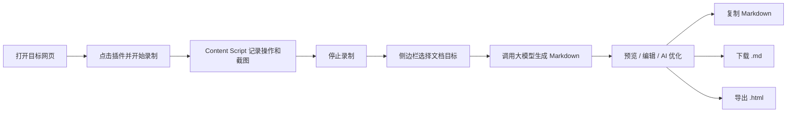
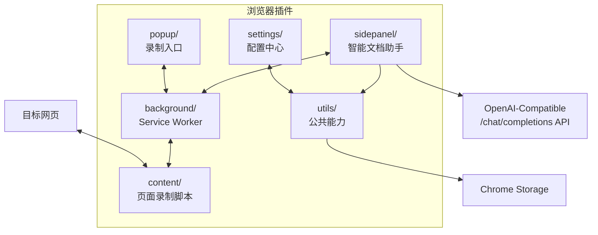

# Smart Page Scribe

<p align="center">
  
</p>

<p align="center">
  <strong>浏览器操作录制 + AI 文档生成助手</strong><br>
  记录网页操作流程，自动生成可编辑、可优化、可导出的操作文档。
</p>

<p align="center">
  
  
  
  
</p>

---

## 项目简介

Smart Page Scribe 是一个浏览器插件项目，面向需要沉淀网页操作流程的人：测试人员、实施顾问、产品经理、客服/运维同学，或任何经常需要写“怎么操作”的人。

它会在网页中记录点击、输入、页面跳转等关键步骤，并在每一步保留截图。录制结束后，插件把这些步骤交给兼容 OpenAI Chat Completions 格式的大模型，生成结构化文档。用户还可以在侧边栏中继续编辑、AI 优化、回退、复制、下载 Markdown，或导出为 HTML。

---

## 界面一览

<p align="center">
  
</p>

| 页面 | 作用 |
| --- | --- |
| Popup 弹窗 | 开始录制、停止录制、查看录制状态、打开编辑器 |
| Side Panel 智能文档助手 | 选择文档类型、生成文档、预览/编辑 Markdown、AI 优化、回退、导出 |
| Settings 设置页 | 配置 API Key、Base URL、模型名、最大输出 Token、提示词、文档资源 |
| Content Script | 注入目标网页，采集用户操作和截图 |
| Background Service Worker | 管理录制会话、消息转发、截图、Content Script 自动注入 |

---

## 核心功能

### 1. 网页操作录制

- 一键开始/停止录制。
- 自动记录点击、输入、路由变化等操作。
- 每个步骤可关联页面截图。
- 支持在 Content Script 未注入时自动补注入，减少“刷新页面后重试”的干扰。

### 2. AI 文档生成

- 根据录制步骤生成 Markdown 文档。
- 默认提示词偏向简洁、可执行的用户指南。
- 自动对敏感输入做遮蔽处理。
- 支持用户追加要求或完全自定义提示词。
- 支持配置最大输出 Token，避免长文档被截断。

### 3. 文档编辑与导出

- Markdown 预览与源码编辑双模式。
- 一键复制 Markdown。
- 下载 Markdown 文件。
- 导出独立 HTML 文件。
- AI 二次优化：用户输入优化要求后重新润色文档。
- 支持回退到 AI 优化前版本。

### 4. 文档资源管理

- 支持上传和管理 PDF、DOCX、TXT 等文档资源。
- 支持搜索、刷新、删除等基础管理操作。
- 相关逻辑封装在 `utils/documentUpload.js`、`utils/documentApi.js`、`utils/docUIUtils.js`。

---

## 工作流程



---

## 架构图



---

## 支持的模型 API

当前项目按 OpenAI 兼容的 Chat Completions 格式调用模型接口：

```text
POST {Base URL}/chat/completions
```

只要服务商兼容这个请求格式，通常都可以通过设置页配置：

| 配置项 | 说明 | 示例 |
| --- | --- | --- |
| API Key | 模型服务密钥 | `sk-...` |
| Base URL | API 基础地址 | `https://api.openai.com/v1` |
| 模型名 | Chat Completions 模型名称 | `gpt-4o-mini`、`deepseek-chat` |
| 最大输出 Token | 控制生成文档长度 | `4000` |
| 提示词模式 | 追加要求或完全自定义 | 默认提示词 + 我的要求 |

常见可尝试的服务：

- OpenAI API
- DeepSeek API
- 其他提供 OpenAI-compatible `/chat/completions` 的模型网关或服务商

> 注意：不同服务商的模型名、Base URL、上下文长度和计费规则不同，以对应服务商文档为准。

---

## 生成文档格式

| 格式 | 用途 | 当前支持 |
| --- | --- | --- |
| Markdown `.md` | 默认生成格式，方便编辑和复制 | 支持 |
| HTML `.html` | 独立页面，方便交付或浏览器打开 | 支持 |
| PDF `.pdf` | 固定版式交付 | 暂未内置，可先导出 HTML 后用浏览器打印为 PDF |

---

## 安装使用

### 方式一：直接加载源码目录

适合只想使用插件、不关心构建流程的场景。

1. 下载或克隆本项目。
2. 打开 Chrome/Edge 的扩展管理页：
   - Chrome: `chrome://extensions/`
   - Edge: `edge://extensions/`
3. 开启“开发者模式”。
4. 点击“加载已解压的扩展程序”。
5. 选择项目根目录 `smartpages/`。

### 方式二：构建后加载 `dist/`

适合开发、发布或确认打包产物的场景。

```bash
npm install
npm run build
```

然后在扩展管理页加载 `dist/` 目录。

### 为什么浏览器插件项目里会有 npm？

npm 不是插件运行时依赖。插件在浏览器中运行，核心代码是原生 HTML/CSS/JavaScript。

这里使用 npm 主要是为了开发体验：

- 用 Vite 复制和整理扩展文件到 `dist/`。
- 用 ESLint 做代码检查。
- 用 TypeScript 做 JS 类型检查。
- 统一执行 `build`、`lint`、`typecheck` 等命令。

---

## 快速上手

1. 打开设置页，填写 API Key、Base URL、模型名。
2. 点击“测试连接”，确认模型 API 可用。
3. 打开需要记录流程的网页。
4. 点击插件图标，开始录制。
5. 在网页上完成操作流程。
6. 停止录制，进入侧边栏。
7. 选择推荐的文档目标，或输入自定义描述。
8. 生成文档后进行预览、编辑、AI 优化或导出。

---

## 项目结构

```text
smartpages/
├─ manifest.json              # Chrome Extension Manifest V3 配置
├─ popup/                     # 插件弹窗：开始/停止录制
├─ sidepanel/                 # 智能文档助手：生成、预览、编辑、导出
├─ settings/                  # 设置页：模型、提示词、文档资源
├─ background/                # Service Worker：会话、截图、消息转发
├─ content/                   # Content Script：网页操作录制
├─ utils/                     # 通用工具、配置、文档上传/API/UI 工具
├─ styles/                    # 共享样式变量
├─ libs/                      # 本地第三方库，例如 marked.js
├─ icons/                     # 插件图标
├─ upload/                    # 文档上传相关扩展模块
├─ docs/                      # 文档/API/模拟和测试资料
├─ scripts/                   # 构建辅助脚本
├─ validate.js                # JS 语法校验脚本
└─ vite.config.js             # 构建配置
```

---

## 主要命令

```bash
npm run build       # 生成 dist/ 扩展目录
npm run dev         # watch 模式构建
npm run lint        # ESLint 检查
npm run lint:fix    # 自动修复可修复问题
npm run typecheck   # TypeScript 类型检查
node validate.js    # 核心 JS 文件语法校验
```

---

## 安全与隐私

- API Key 存储在 Chrome Storage 中。
- 扩展页面启用 CSP，禁止外部脚本直接注入。
- 第三方库本地打包，避免运行时依赖 CDN。
- 生成提示词会要求对密码、Token、手机号、身份证号等敏感内容进行遮蔽。
- 文档渲染使用受控方式处理动态内容，降低 XSS 风险。

---

## 当前状态

| 模块 | 状态 |
| --- | --- |
| 录制操作 | 可用 |
| 截图采集 | 可用 |
| AI 文档生成 | 可用 |
| 提示词配置 | 可用 |
| 最大输出 Token 配置 | 可用 |
| Markdown 导出 | 可用 |
| HTML 导出 | 可用 |
| AI 二次优化与回退 | 可用 |
| 文档上传管理 | 可用 |
| PDF 直接导出 | 规划中 |

---

## 开发建议

- 修改 UI 后运行 `npm run build`。
- 修改 JS 后运行 `node validate.js` 和 `npm run typecheck`。
- 录制相关问题优先检查 `background/background.js` 与 `content/recorder.js`。
- 文档生成质量优先调整 `utils/common.js` 中的默认提示词和 `sidepanel/sidepanel.js` 中的文档类型说明。
- 设置页字段变更需要同步 `settings/settings.html`、`settings/settings.js` 和 `utils/common.js`。

---

## License

[MIT License](LICENSE)
