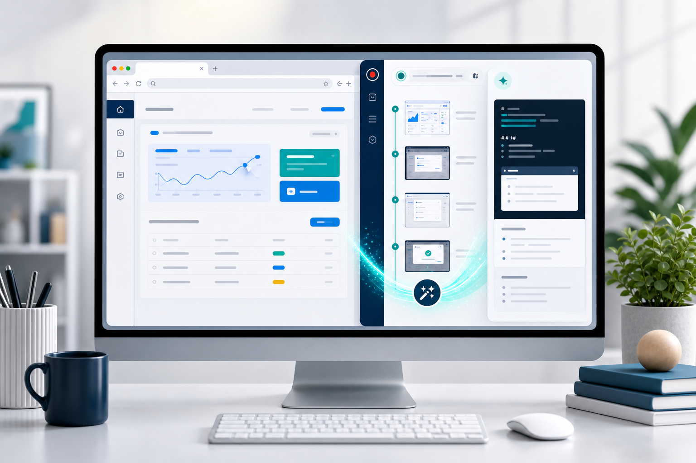
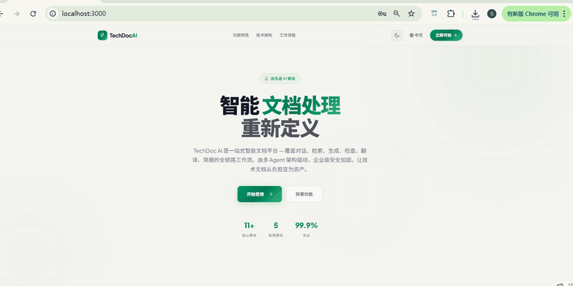

<p align="center">
  
</p>

<h1 align="center">SmartPages</h1>

<h3 align="center">把浏览器操作流程变成专业文档</h3>

<p align="center">
  只需录制一次点击和截图，即可使用你选择的 AI 模型生成可编辑的<br>
  用户指南、教程、测试用例和 Bug 报告。
</p>

<p align="center">
  <a href="#快速开始"><strong>快速开始</strong></a> ·
  <a href="docs/examples/README.md">示例文档</a> ·
  <a href="#项目文档">项目文档</a> ·
  <a href="README.md">English</a>
</p>

<p align="center">
  
  
  
</p>

<p align="center">
  
</p>

<p align="center"><strong>录制 → 生成 → 优化 → 导出</strong></p>

## SmartPages 能生成什么？

<table>
  <tr>
    <td width="33%" align="center">
      <h3>🧭 用户指南</h3>
      录制一次产品操作，自动整理成清晰的分步指南。
    </td>
    <td width="33%" align="center">
      <h3>🧪 测试用例</h3>
      捕获真实浏览器流程，生成结构化的 QA 文档。
    </td>
    <td width="33%" align="center">
      <h3>🐞 Bug 报告</h3>
      复现一次问题，完整保留每一步操作和截图。
    </td>
  </tr>
</table>

SmartPages 省去文档工作中最耗时的部分：操作完成后，再重新整理每一个步骤、截图和说明。

## 它如何工作

1. **录制**——正常完成网页操作，SmartPages 自动捕获动作和步骤截图。
2. **生成**——选择文档目标，使用 GPT、Gemini、Claude、DeepSeek 或其他兼容模型生成初稿。
3. **交付**——直接编辑或继续优化，然后按需要保存、复制或导出。

## 快速开始

### 1. 构建扩展

```bash
git clone https://github.com/Teddy9710/smartpages.git
cd smartpages
npm install
npm run build
```

### 2. 加载到 Chrome 或 Edge

1. 打开 `chrome://extensions/` 或 `edge://extensions/`。
2. 开启**开发者模式**。
3. 点击**加载已解压的扩展程序**，选择项目中的 `dist/` 目录。

### 3. 生成第一份文档

1. 打开 SmartPages 设置页并配置模型服务商。
2. 进入需要记录的网页并开始录制。
3. 完成操作、停止录制，然后选择文档目标。
4. 在侧边栏中生成、编辑并导出结果。

> 修改源码后，请重新运行 `npm run build` 并在扩展管理页重新加载。不要直接加载源码根目录。

## 看看实际效果

<p align="center">
  
</p>

## 核心能力

- **记录真实操作：**捕获点击、输入、SPA 页面跳转、内嵌 frame 交互和步骤截图，并可随时暂停和继续。
- **按目标生成：**内置用户指南、教程、测试用例和 Bug 报告等目标，也支持完全自定义提示词。
- **控制文档输出：**应用风格指南和示例，选择 Markdown 或 HTML，并配置最大 Token。
- **交付前继续编辑：**编辑渲染后的文档或 Markdown 源码，使用 AI 二次优化，并在需要时回退。
- **导出到不同场景：**复制或导出为 Markdown、HTML、纯文本、Word、ZIP、图片和 PDF。
- **保留文档历史：**保存到授权的本地文件夹，也可选择配置 Supabase 云同步。

## 模型支持

SmartPages 支持：

- **OpenAI-compatible Chat Completions：**OpenAI、Gemini、GLM、DeepSeek、MiniMax、Kimi、OpenRouter、SiliconFlow、DashScope，以及自定义兼容服务。
- **Anthropic Messages API：**通过 Anthropic 使用 Claude 模型。

服务商、Base URL、模型和 API Key 均由你选择，对应服务的限制和费用也由你掌控。

## 默认保护隐私

- API Key 保存在 Chrome Storage 中，不会写入仓库。
- 录制内容只在生成文档时发送到你配置的模型 API。
- Supabase 同步默认关闭，只有完成配置、登录并主动保存后才会上传。
- 本地历史只能访问你通过浏览器目录选择器明确授权的文件夹。
- 动态 HTML 在渲染和导出前会经过清理，扩展页面使用 Manifest V3 CSP。

即使生成提示词会要求遮蔽敏感信息，录制时仍应避开密码、Token、证件号等内容。

## 高级工作流

SmartPages 还可以导出机器可读的 `.smartpages.json` 工作流，在安全检查下进行本地回放，并通过实验性的 MCP Bridge 将经过批准的工作流提供给本地 Agent。

[阅读可执行工作流与本地 Agent Bridge 指南 →](docs/advanced-workflows.zh-CN.md)

## 项目文档

- [示例文档](docs/examples/README.md)
- [快速上手](QUICKSTART.md)
- [Supabase 云存储](docs/cloud-storage-supabase.md)
- [高级工作流与 Agent Bridge](docs/advanced-workflows.zh-CN.md)
- [测试指南](TESTING.md)
- [故障排查](TROUBLESHOOTING.md)
- [代码结构](CODE_STRUCTURE.md)

## 开发与贡献

```bash
npm run dev         # watch 模式构建 dist/
npm test            # 运行测试
npm run lint        # ESLint 检查
npm run typecheck   # TypeScript 类型检查
npm run build       # 生成可加载的 dist/
npm run verify      # 运行完整验证
```

欢迎提交 Issue 和 Pull Request。贡献前请阅读[贡献者许可协议（CLA）](CONTRIBUTING.md)。

## 许可证

SmartPages 采用双许可证模式：

| 使用场景 | 许可证 | 说明 |
| --- | --- | --- |
| 个人、学习、非商业用途 | [GPL v3](LICENSE) | 可免费使用、修改和分发；衍生作品需继续开源 |
| 商业用途 | 商业许可证 | 集成到商业产品、SaaS 或企业部署前需另行获得授权 |

版权所有者（汪鸿儒 / Hongru Wang）保留所有商业权利。商业授权咨询请通过 GitHub Issues 联系作者。
