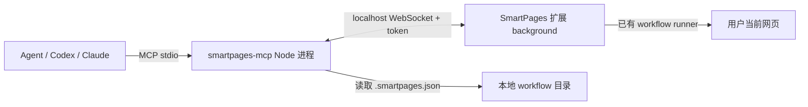

# SmartPages 轻量 Agent Bridge 设计

## 1. 背景与目标

第一阶段已经让 SmartPages 能从一次人工操作生成 `.smartpages.json`，并在浏览器扩展内部手动回放。第二阶段的目标是让外部 Agent 可以调用这些可执行 workflow，让用户把“操作文档 + JSON 文档”交给自己的 Agent 后，Agent 能通过 SmartPages 在当前浏览器会话里执行页面操作。

本设计采用轻量化路线：先做一个本机可运行、可验证、代码量可控的 Agent Bridge，而不是一步到位做常驻 Broker、Native Messaging Host、Windows 安装器或企业级权限系统。

Phase 2A 的成功标准是：

- 用户可以启动一个本地 `smartpages-mcp` Node 进程。
- SmartPages 扩展可以连接这个本地进程。
- Agent 可以通过 MCP 工具列出 workflow、启动执行、查询状态、取消执行。
- 所有实际页面操作仍由浏览器扩展完成，并继续沿用第一阶段的 workflow 校验、origin 限制、风险控制和执行状态机。

## 2. 非目标

本阶段明确不做以下内容：

- 不做长期常驻 Broker。
- 不做 Native Messaging。
- 不做 `.exe` 安装器、自动启动、系统托盘或后台服务。
- 不做云端 workflow 仓库。
- 不支持多用户、多浏览器实例协调或远程调用。
- 不提供任意 JavaScript 执行、任意文件读取或绕过浏览器权限的能力。
- 不绕过扩展内部的高风险动作确认机制。

这些能力可以作为后续 Phase 2B / Phase 3 讨论，但不进入当前轻量版实现计划。

## 3. 总体架构



架构中的职责边界：

- Agent 只通过 MCP 工具表达意图。
- `smartpages-mcp` 负责 MCP 协议、本地 workflow 文件读取、连接管理和请求转发。
- SmartPages 扩展负责真实浏览器操作、运行状态、暂停、取消、风险确认和页面错误处理。
- 本地 workflow 目录只存放用户导出的 `.smartpages.json` 文件，不存储浏览器 cookie、密码或页面登录态。

## 4. 本地运行形态

Phase 2A 增加一个仓库内包：

```text
packages/smartpages-mcp/
  package.json
  src/
    index.js
    mcp-server.js
    workflow-store.js
    bridge-server.js
    protocol.js
```

开发期命令：

```bash
npm run mcp:serve
```

运行时行为：

1. `smartpages-mcp` 启动 MCP stdio server。
2. 同一进程启动一个只监听 `127.0.0.1` 的 WebSocket server。
3. 进程生成或读取本地 token，并在终端打印连接提示。
4. 用户在 SmartPages 设置页填入 host、port、token。
5. 扩展 background 连接 WebSocket，并完成 hello 握手。
6. Agent 调用 MCP 工具时，`smartpages-mcp` 把请求转发给已连接的扩展。

默认 workflow 目录：

```text
%LOCALAPPDATA%\SmartPages\workflows\
```

如果该目录不存在，`smartpages-mcp` 可以创建目录并返回空列表。开发期允许通过环境变量覆盖：

```text
SMARTPAGES_WORKFLOW_DIR
```

## 5. 连接与认证

本阶段使用轻量 token，而不是系统级密钥管理。

认证规则：

- WebSocket 只监听 `127.0.0.1`。
- `smartpages-mcp` 首次启动时生成随机 token。
- token 存在 `%LOCALAPPDATA%\SmartPages\bridge-token.json`。
- 扩展设置页保存 host、port、token 到 `chrome.storage.local`。
- 扩展连接后必须先发送 `hello` 消息。
- token 错误、协议版本不兼容或扩展 ID 不匹配时，server 关闭连接。

示例 hello 消息：

```json
{
  "type": "hello",
  "protocolVersion": 1,
  "extensionId": "chrome-extension-id",
  "token": "local-random-token"
}
```

安全边界说明：

- 这不是最终企业级安全模型。
- 它足够支撑本机开发、早期用户验证和产品路径验证。
- 如果后续要进入 Chrome Web Store 或企业分发，再升级到 Native Messaging、安装器注册、系统密钥存储和更严格的 origin / extension allowlist。

## 6. MCP 工具设计

Phase 2A 只提供 4 个 MCP 工具。

### 6.1 `list_workflows`

用途：读取本地 workflow 目录，列出可执行 workflow 摘要。

输入：

```json
{}
```

输出：

```json
{
  "workflows": [
    {
      "workflowId": "create-customer",
      "workflowVersion": 1,
      "title": "创建客户",
      "fileName": "create-customer.smartpages.json",
      "allowedOrigins": ["https://example.com"],
      "variables": [
        { "name": "customerName", "required": true, "secret": false }
      ],
      "stepCount": 8,
      "hasHighRiskSteps": false
    }
  ]
}
```

要求：

- 必须校验 JSON schema。
- 无效文件不让 Agent 执行，但可以在结果中返回 `invalidWorkflows` 摘要，帮助用户修复。
- 不返回完整 step 细节，避免把敏感页面结构或输入值直接暴露给 Agent。

### 6.2 `start_run`

用途：启动某个 workflow。

输入：

```json
{
  "workflowId": "create-customer",
  "workflowVersion": 1,
  "variables": {
    "customerName": "Acme"
  }
}
```

输出：

```json
{
  "runId": "run_123",
  "status": "RUNNING",
  "currentStepId": "step_1"
}
```

要求：

- `smartpages-mcp` 先验证 workflow 文件和变量。
- 如果扩展未连接，返回 `EXTENSION_OFFLINE`。
- 如果变量缺失，返回 `MISSING_VARIABLES`，并列出缺失变量名。
- 如果 workflow 的 `allowedOrigins` 与当前标签页不匹配，由扩展返回 `ORIGIN_MISMATCH`。
- 真正执行由扩展已有 workflow runner 完成。

### 6.3 `get_run_status`

用途：查询当前 run 的结构化状态。

输入：

```json
{
  "runId": "run_123"
}
```

输出：

```json
{
  "runId": "run_123",
  "status": "WAITING_INPUT",
  "currentStepId": "step_4",
  "message": "需要用户在扩展中选择目标元素",
  "stepsCompleted": 3,
  "stepsTotal": 8,
  "pendingRequest": {
    "type": "USER_INPUT_REQUIRED"
  }
}
```

要求：

- 状态以结构化枚举为准，不依赖自然语言判断。
- 可返回脱敏错误信息、当前步骤、完成进度和待处理事项。
- 不默认返回截图、DOM 快照、cookie 或页面源码。

### 6.4 `cancel_run`

用途：取消正在执行的 run。

输入：

```json
{
  "runId": "run_123"
}
```

输出：

```json
{
  "runId": "run_123",
  "status": "CANCELLED"
}
```

要求：

- `runId` 必须精确匹配当前 run。
- 如果 run 已完成，返回当前终态，不重复取消。
- 取消请求转发到扩展，由扩展安全停止当前执行。

## 7. WebSocket Bridge 协议

WebSocket 消息采用 request / response 结构。

请求：

```json
{
  "id": "msg_1",
  "type": "startRun",
  "payload": {}
}
```

响应：

```json
{
  "id": "msg_1",
  "ok": true,
  "payload": {}
}
```

错误：

```json
{
  "id": "msg_1",
  "ok": false,
  "error": {
    "code": "EXTENSION_OFFLINE",
    "message": "SmartPages extension is not connected."
  }
}
```

协议要求：

- 每个请求必须有唯一 `id`。
- `smartpages-mcp` 对转发请求设置超时。
- 扩展断开时，正在等待的 MCP 请求以 `EXTENSION_DISCONNECTED` 失败。
- 同一时间只支持一个扩展连接；新连接通过认证后可以替换旧连接。
- Phase 2A 不做请求队列持久化，进程重启后状态丢失。

## 8. 扩展侧改动

扩展增加轻量 Bridge client：

```text
background/agent-bridge-client.js
settings/agent-bridge-settings.js
```

职责：

- 从 `chrome.storage.local` 读取 bridge 配置。
- 建立 WebSocket 连接并自动重连。
- 发送 hello 消息。
- 接收 `startRun`、`getRunStatus`、`cancelRun` 请求。
- 调用第一阶段已有的 workflow runner。
- 把结构化结果返回给 `smartpages-mcp`。

设置页增加：

- Bridge host，默认 `127.0.0.1`。
- Bridge port。
- token。
- 连接状态。
- “测试连接”按钮。
- 简短启动说明。

本阶段不要求扩展主动扫描 workflow 目录。workflow 文件由 `smartpages-mcp` 读取，扩展只接收已经验证过的 workflow 内容或 workflow run 请求。

## 9. 数据流

典型执行流程：

1. 用户用 SmartPages 录制操作。
2. 用户导出 Markdown 文档和 `.smartpages.json`。
3. 用户把 JSON 放入 `%LOCALAPPDATA%\SmartPages\workflows\`。
4. 用户启动 `npm run mcp:serve`。
5. 用户在扩展设置页连接 Bridge。
6. Agent 调用 `list_workflows`。
7. Agent 根据用户目标选择 workflow 并调用 `start_run`。
8. 扩展在当前浏览器标签页执行 workflow。
9. Agent 轮询 `get_run_status`。
10. 如果需要人工确认或输入，扩展暂停并提示用户。
11. 用户在扩展中确认或处理后，执行继续。
12. Agent 得到 `COMPLETED`、`FAILED`、`CANCELLED` 或 `WAITING_INPUT` 等状态。

## 10. 错误处理

标准错误码：

- `WORKFLOW_NOT_FOUND`
- `WORKFLOW_INVALID`
- `MISSING_VARIABLES`
- `EXTENSION_OFFLINE`
- `EXTENSION_DISCONNECTED`
- `BRIDGE_AUTH_FAILED`
- `PROTOCOL_VERSION_UNSUPPORTED`
- `ORIGIN_MISMATCH`
- `RUN_NOT_FOUND`
- `RUN_ALREADY_ACTIVE`
- `RUN_CANCELLED`
- `RUN_FAILED`
- `TIMEOUT`

原则：

- 错误必须结构化。
- 错误信息不能泄漏敏感输入值。
- Agent 能根据错误码决定是否重试、补变量、提醒用户打开扩展或停止任务。

## 11. 测试策略

测试覆盖：

- workflow store：读取目录、过滤 `.smartpages.json`、schema 校验、无效文件摘要。
- MCP 工具：参数校验、workflow 不存在、变量缺失、扩展离线。
- WebSocket 协议：hello 成功、token 错误、协议版本错误、请求响应匹配、超时、断线。
- 扩展 bridge client：连接配置、重连、消息分发、runner 调用、取消精确匹配 runId。
- 安全回归：不能访问任意文件、不能执行未知 action、不能绕过 allowedOrigins、不能绕过高风险确认。
- 端到端模拟：启动 bridge，连接一个模拟扩展 client，完成 list/start/status/cancel 全流程。

验收命令仍以仓库现有验证为主：

```bash
npm run verify
```

新增 MCP 包后，如果需要独立测试，可以增加：

```bash
npm run test:mcp
```

## 12. 验收标准

Phase 2A 完成时必须满足：

- `smartpages-mcp` 可以本地启动，并显示 host、port、token、workflow 目录。
- 扩展设置页可以连接本地 Bridge，并显示连接状态。
- Agent 可以调用 `list_workflows` 获取 workflow 摘要。
- Agent 可以调用 `start_run` 让扩展启动 workflow。
- Agent 可以调用 `get_run_status` 读取结构化状态。
- Agent 可以调用 `cancel_run` 精确取消当前 run。
- 扩展离线、token 错误、workflow 无效、变量缺失、origin 不匹配都有稳定错误返回。
- 所有现有第一阶段 workflow 测试继续通过。

## 13. 后续升级路径

如果 Phase 2A 验证成立，后续可以按以下顺序升级：

1. Phase 2B：把 WebSocket Bridge 换成 Native Messaging，提高 Chrome 扩展分发和安全一致性。
2. Phase 2C：增加 Windows 安装器、自动配置 Agent MCP、自动注册 host。
3. Phase 3：增加团队 workflow 仓库、权限控制、审计日志和集中分发。
4. Phase 4：增加更强的语义定位恢复、多标签页流程、文件上传下载和条件分支。

这条路径允许当前版本保持小而可验证，同时不堵死后续产品化空间。
